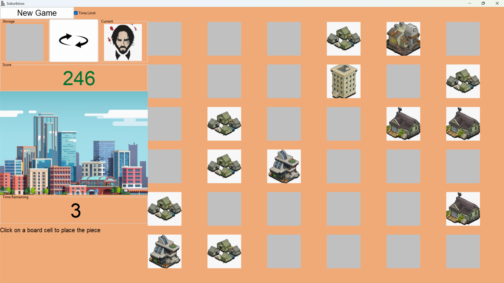

# Suburbious (Classic Python Edition)


> **🚀 2026 MODERN REMAKE AVAILABLE:**
> This repository contains the original legacy source code of my 1st-Year University Project (Computer Engineering). 
> I have recently completely rewritten, polished, and evolved this game from scratch using modern web technologies (HTML, CSS, JavaScript). 
> 
> You can play the fully polished, production-ready version here:
> - **[Play on Itch.io](https://imocigames.itch.io/suburbious)**
> - **[Download on Google Play Store](https://play.google.com/store/apps/details?id=com.imocigames.suburbious)**

---

## About the Original Version (This Repository)

"Suburbious" is a puzzle and resource-management video game originally developed as the final project for the **Programming Paradigms** course. 

The main objective of the game is to strategically place different structures on a grid board to score the highest possible points while managing building collapses, Bigfoot invasions, and limited resources.

### Gameplay


###Tech Stack
- **Language:** Python 3
- **GUI Framework:** `wxPython` (Desktop Application)
- **Paradigm:** Object-Oriented Programming (OOP)

### Key Technical Features
* **2D Matrix Logic:** Advanced management of collisions, neighborhoods, and spatial routing within a dynamic grid.
* **Propagation Algorithms:** Recursive functions to detect and execute building "collapses" when 3 or more structures of the same type are adjacent (Match-3 mechanics).
* **Dynamic UI Rendering:** Real-time swapping of graphical elements, button state management, and asynchronous event handling (`wx.Timer`).

---

## How to Run Locally

If you want to run this classic version on your machine, you will need the graphic and audio assets in the same directory as the script.

**1. Clone the repository:**
```bash
git clone [https://github.com/TU_USUARIO/suburbious-python-legacy.git](https://github.com/TU_USUARIO/suburbious-python-legacy.git)
cd suburbious-python-legacy
```

**2. Install dependencies:**
```bash
pip install -r requirements.txt
```

**3. Run the application:**
```bash
python suburbious.py
```

## Original Authors
-Iván Moro Cienfuegos
-Daniel Viñas Vega
